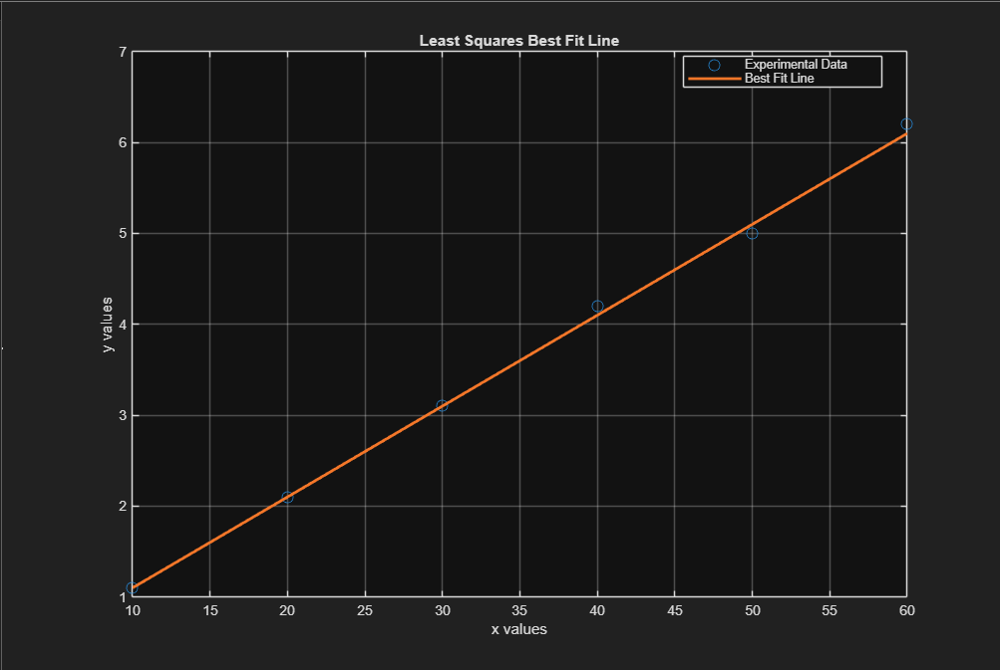
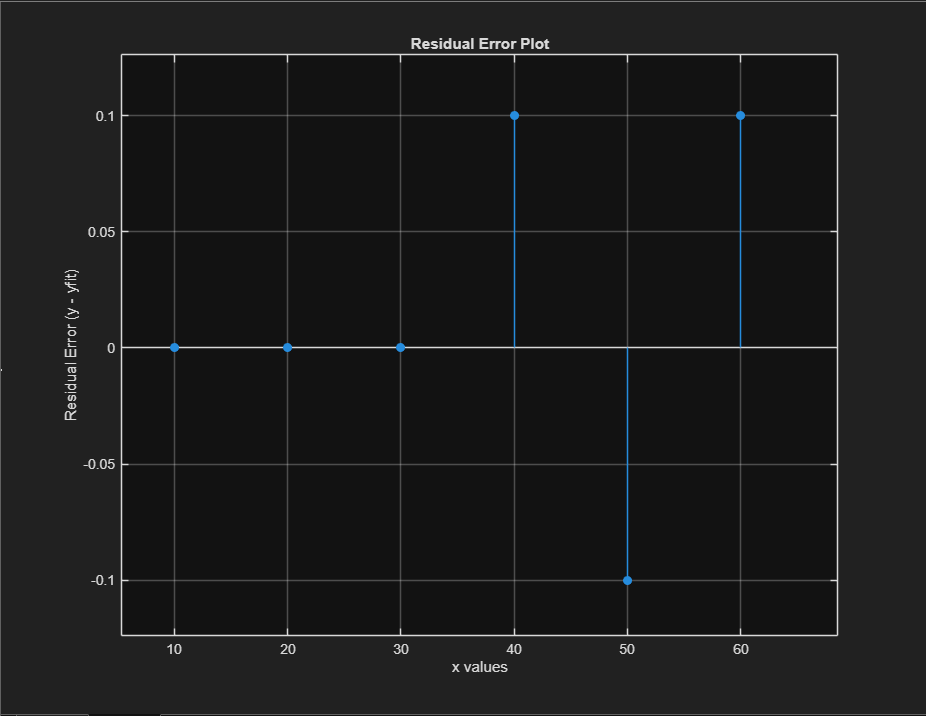

# CEL Case Study 1  
## Development of a General Linear Least Squares Solver in MATLAB  
### Application Example: Hooke’s Law (Spring System)

---

## 📌 Project Overview

This case study presents the development of a general-purpose MATLAB solver for linear least squares regression of the form:

\[
y = mx + c
\]

The objective of the solver is to determine optimal values of slope (m) and intercept (c) by minimizing the total squared error between observed data and predicted values.

The solver is designed to work for **any linear dataset**.  
Hooke’s Law (Load vs Extension of a spring) is used as a validation example to demonstrate its practical application.

---

## 🎯 Objective

- Develop a general MATLAB program capable of solving linear regression problems.
- Implement the Least Squares Method numerically.
- Validate the solver using experimental spring data.
- Perform residual analysis to evaluate accuracy.

---

## 🧮 Mathematical Model

The general linear model assumed is:

\[
y = mx + c
\]

For each data point:

\[
\hat{y}_i = mx_i + c
\]

Residual error:

\[
r_i = y_i - \hat{y}_i
\]

Total squared error:

\[
S = \sum_{i=1}^{n} (y_i - (mx_i + c))^2
\]

The solver determines the values of **m** and **c** that minimize S.

---

## ⚙ Methodology

The program follows these steps:

1. Accept number of data points.
2. Accept input dataset (x and y values).
3. Assume linear relationship \( y = mx + c \).
4. Perform brute-force numerical search over multiple values of m and c.
5. Compute total squared error for each combination.
6. Select the combination that produces minimum error.
7. Display:
   - Best-fit equation
   - Minimum squared error
   - Graphical plots

Although brute-force is computationally slower than matrix-based solvers, it provides strong conceptual clarity and transparency in understanding the least squares principle.

---

## 📊 Application Example: Hooke’s Law

Hooke’s Law states:

\[
F = kx
\]

Where:
- F = Load (Force)
- x = Extension
- k = Spring stiffness

Since experimental data may contain small measurement errors, the linear relationship is modeled as:

\[
F = kx + c
\]

### Experimental Dataset Used

| Load (N) | Extension (mm) |
|----------|---------------|
| 10 | 1.1 |
| 20 | 2.1 |
| 30 | 3.1 |
| 40 | 4.2 |
| 50 | 5.0 |
| 60 | 6.2 |

---

## 📈 Results

Best Fit Line Obtained:

\[
y = 0.1000x + 0.1000
\]

Slope (m) = 0.1000  
Intercept (c) = 0.1000  

Minimum Squared Error:

\[
S = 0.030000
\]

The slope represents the spring stiffness:

\[
k = 0.1000 \, \text{N/mm}
\]

---

## 📂 Repository Files

- **cel case study 1.pdf**  
  Complete project report including theory, derivation, methodology, and analysis.

- **cel_case_study1_final.m**  
  MATLAB implementation of the general least squares solver.

- **ideal line.PNG**  
  Plot showing experimental data and best-fit line.

- **residual.PNG**  
  Residual error plot showing deviation from fitted line.

- **results.PNG**  
  MATLAB command window output showing computed parameters.

---

## 🖥 How to Run the Program

1. Download `cel_case_study1_final.m`
2. Open MATLAB
3. Navigate to file location
4. Run the script
5. Enter dataset values when prompted
6. View generated plots and results

---

## 📊 Graphical Output

### Least Squares Best Fit Line

---

### Residual Error Plot

---

## 🔍 Discussion

The developed solver successfully determines optimal linear parameters for any dataset following the model \( y = mx + c \).

Key observations:

- The best-fit line closely represents the experimental data.
- Residual errors are small and randomly distributed.
- The solver is general and can be applied to various engineering systems.

### Potential Applications

- Stress-strain linear region analysis
- Voltage-current characterization
- Calibration of sensors
- Experimental data fitting
- Material testing

### Limitations

- Brute-force approach is computationally intensive for large datasets.
- Accuracy depends on step size resolution.
- Applicable only to linear relationships.

---

## 📚 References

- Engineering Mathematics – Least Squares Method
- MATLAB Documentation – Numerical Computation
- Classical Mechanics – Hooke’s Law

---

## 👨‍💻 Author

Name: Mihir G. Gohil  

---
